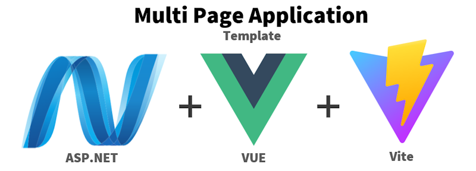

# Code Endeavors ASP.NET + Vue Multi Page Application Template
The purpose of this template is to allow normal ASP.NET MVC application development to be easily intermixed with the power of a reactive UI using Vue. 

# Background
I have been involved developing front end frameworks for multiple Content Managements Systems over the last couple decades.  
DotNetNuke was the beginning of this, where I was in charge of developing its [ClientAPI](https://dotnetnuke.nl/LinkClick.aspx?fileticket=LktZ8e1P3tA%3D&tabid=600&portalid=16&mid=1379&forcedownload=true).
A couple years after this I created my own open source CMS called [Videre](https://www.viderecms.net/) where I introduced the concept of [Client Side Presenters](https://www.viderecms.net/develop/client-side-presenters.html#overview).  Each of these efforts was about allowing a Microsoft back end web framework (ASP.NET) efficiently interact with a rich user interface.  This template represents my latest approach to providing a solution to developing a multi-page application with a reactive front end.

# Quick Start VSCode
Download the nuget template package
```console
dotnet new install codeendeavors-aspnetvuempa
```

Create your new project
```console
dotnet new codeendeavors-aspnetvuempa -o "myvueapp"
```

After the app installs you will be prompted to do a npm install
```console
Processing post-creation actions...
Template is configured to run the following action:
Description: npm install
Actual command: dotnet build -t:npmInstall
Do you want to run this action [Y(yes)|N(no)]?
```
*If you decide not to run this script you will need to navigate to your myvueapp.Web folder and manually run a npm install.*

Once installed simply open up the folder you installed the files to in VSCode and hit F5.

# Quick Start Visual Studio
...


# Anatomy of a Page

## Script / Style Registration
Most ASP.NET MVC sites utilize a common [_Layout.cshtml](https://learn.microsoft.com/en-us/aspnet/mvc/overview/getting-started/introduction/adding-a-view) file to render things like the common script, css, and general layout of their sites.  This template makes this assumption as well.  This is where the Vue runtime, vue component css, and vue component js scripts are registered.

```html
<link rel="stylesheet" href="~/css/site.min.css" asp-append-version="true" />  @* CSS from static/css (esbuild compile)  *@
<link rel="stylesheet" href="~/js/style.css" asp-append-version="true" />      @* CSS from vue components (vite compile) *@
<script src="~/js/vue.global.prod.js"></script>
<script src="~/js/myapp.umd.js" asp-append-version="true"></script>
```

## App Initialization
The myapp.js (name is configurable) file contains common methods, including the one to initialize the app with Vue.  It exposes itself by adding an instance to the global (window) object.  So you can simply call myapp.initApp to initialize the vue runtime.

### Layout Page
Here is a simplified version of the _layout page.  Hopefully vue developers recognize this to feel a lot like the [Composition API](https://vuejs.org/api/composition-api-setup).

```html
<head>
...
    <script>
		(() => {    //internalize all variables
            const { SunIcon, MoonIcon } = myapp.icons;
            const { ProgressBar } = myapp.components;
			const { ref, watch } = Vue;

            const layoutApp = {
                components: { SunIcon, MoonIcon, ProgressBar },
                setup() {
                    const darkMode = ref(false);

                    const toggleDarkMode = () => {
                        darkMode.value = !darkMode.value;
                    }

                    return {
                        darkMode,
                        toggleDarkMode,
                    }   
                }
            }
            myapp.initApp(layoutApp);

        })();       //internalize all variables
    </script>
</head>
<body id="app">
...
    <main role="main">
        <progress-bar v-if="loading"></progress-bar>    @* normal vue component (imported in static\vue\myapp.js) *@
        @RenderBody()
    </main>
...
@await RenderSectionAsync("Scripts", required: false)
</body>
```

### View page
Normal MVC View pages look even more like a standard vue page (with a cshtml extension).
*Just remember that the razor syntax already claims the @ sign, so if you need an event handler you need to double up your @@*

```html
@{
    var COMPONENT_NAME = "customer-search";
    var componentId = Context.GetId(COMPONENT_NAME);
}
<template id="@componentId">
    <table v-if="customers" class="myapp-table">
        <thead>
            <th></th>
            <th>First Name</th>
            <th>Last Name</th>
        </thead>
        <tr v-for="customer in customers">
            <td style="width: 30px; text-align: center"><a :href="`/customer/${customer.id}`"><pencil-square-icon class="myapp-icon"></pencil-square-icon></a></td>
            <td>{{ customer.firstName }}</td>
            <td>{{ customer.lastName }}</td>
        </tr>
    </table>
    <div v-else>Please Wait</div>
</template>

@section Scripts {
<script>
    (() => {
        const { ref } = Vue;
        const { PencilSquareIcon } = myapp.icons;

        myapp.registerComponent('@COMPONENT_NAME',
            document.getElementById('@componentId'),
            {
                components: { PencilSquareIcon },
                setup() {
                   const customers = ref(null);
                   const refreshCustomers = async () => {
                        customers.value = await myapp.ajax({url: '~/Customer/GetCustomers' });
                    }
                    refreshCustomers();
                    return  {
                        customers,
                    }
                }
            }
        );
    })();
</script>
}
```

# Local Template Development

## Enhancing This Template
To enhance this template locally

## Installing 
To test locally simply run this command from the root directory

```console
 dotnet new --install ./src --force
```

## Running In VS Code
To try from VSCode

```console
 dotnet new codeendeavors-aspnetvuempa -o "myvueapp" -I:false
```

To see the available options like adding the CRUD Sample

```console
dotnet new codeendeavors-aspnetvuempa --help
```

## Running In Visual Studio
Once installed you will find this template available within Visual Studio New Project.


## Future
This template has been simplified quite a bit from what I use in my work.  If I have time I may add options to show integration with [tailwind](https://tailwindcss.com/) and [headless ui](https://headlessui.com/).